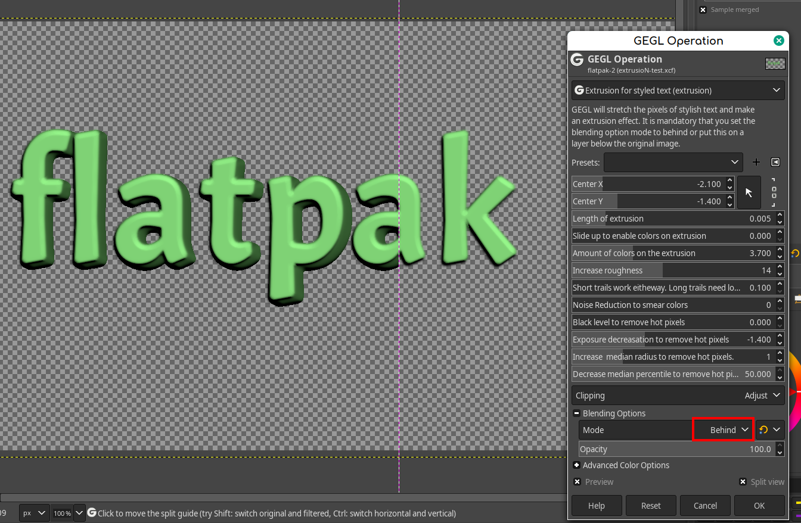

# GEGL-extrusion-effect
GEGL does an extrusion effect on stylish text. This is mostly like the existing long shadow filter but it uses pixel data instead of a color fill.
Put extrusion .so/dll and bevel .so/dll in /gegl-0.4/plug-ins. It is okay to have multiple copies of GEGL:Bevel (The bonus filter that it comes with)

