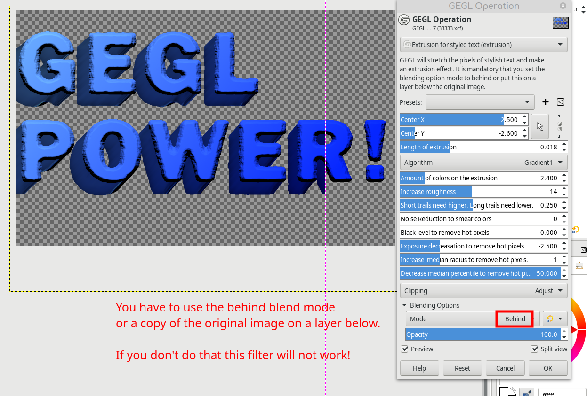

# GEGL-extrusion-effect
GEGL does an extrusion effect on stylish text. This is mostly like the existing long shadow filter but it uses pixel data instead of a color fill.
You must build zzedge and extrusion .so/dll and put them in /gegl-0.4/plug-ins

